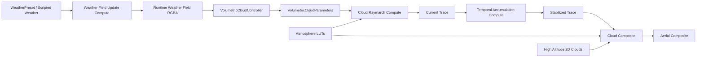

# 体积云详细设计文档

## 1. 文档目的

本文档基于 `Assets/Docs/Cloud/The Real-time Volumetric Cloudscapes of Horizon - Zero Dawn - ARTR.pdf` 的核心思路，结合当前项目 `Assets/VolumetricClouds` 与 `Assets/Atmosphere` 的现有实现，整理一份可以直接指导后续实现与迭代的体积云详细设计方案。

本文档分成两层内容：

- `报告结论`：来自 Horizon Zero Dawn 体积云报告的核心方法论。
- `项目设计`：针对当前 Unity 6 + URP + RenderGraph + Atmosphere 框架的落地改造建议。这部分是基于报告与当前工程状态的设计推导。

## 2. 参考资料

- 本地报告：`Assets/Docs/Cloud/The Real-time Volumetric Cloudscapes of Horizon - Zero Dawn - ARTR.pdf`
- Guerrilla 官方页面：https://www.guerrilla-games.com/read/the-real-time-volumetric-cloudscapes-of-horizon-zero-dawn
- Guerrilla 官方 PDF：https://d3d3g8mu99pzk9.cloudfront.net/AndrewSchneider/The-Real-time-Volumetric-Cloudscapes-of-Horizon-Zero-Dawn.pdf

## 3. 报告核心结论

### 3.1 目标不是“做一朵云”，而是“做可导演的天空系统”

报告里的目标非常明确：

- 云必须可艺术控制，而不是完全随机生成。
- 云必须能表达多种云型，而不是只有一类 fluffy cloud。
- 云必须接入天气系统，并能随时间演化。
- 云必须正确响应时间变化和太阳方向变化。
- GPU 开销必须压到可接受范围，报告中的目标约为 `2 ms`。

### 3.2 云建模采用“低频形体 + 高频侵蚀 + 天气驱动”

报告的核心建模思路不是单纯 fBm，而是分层控制：

- 低频层负责决定大体量、连通性和云团轮廓。
- 高频层负责边缘侵蚀、卷曲和细节破碎感。
- 垂直廓线负责决定不同高度的密度分布。
- 天气图负责决定某个区域的覆盖率、云型和降水倾向。

报告中的典型资源组织是：

- 一张 `128^3` 的基础 3D 噪声，`R` 通道为 `Perlin-Worley`，其余通道为不同频率的 `Worley`。
- 一张 `32^3` 的细节 3D 噪声，用于边缘侵蚀。
- 一张 `128^2` 的 2D curl noise，用于模拟湍流形变。

### 3.3 报告把“云型”视为高度分布规则，而不是简单贴图差异

报告没有把云型理解成不同材质，而是理解成：

- 不同云型在高度上的密度分布不同。
- 覆盖率、降水与云型共同决定最终密度。
- 低空体积云和高空薄云应采用不同表达方式。

报告中的关键分层是：

- `1500m ~ 4000m` 的低空体积云层，采用体积光线步进。
- `4000m` 以上的高空 `alto / cirro` 云层，采用更便宜的 2D 滚动层。

### 3.4 光照模型不是纯物理精确，而是“抓住最重要的视觉特征”

报告聚焦的三个视觉目标是：

- 云的主方向散射感。
- 迎光方向的银边感。
- 云体厚部与边缘的层次差异，也就是所谓的 `powder sugar effect`。

对应的近似项是：

- `Beer-Lambert` 透射，负责基本衰减。
- `Henyey-Greenstein` 各向异性相函数，负责前向散射和银边。
- `Powder` 近似，负责厚云内部和边缘的能量层次。
- 降水云通过提高吸收来主动压暗。

### 3.5 性能来自“少做昂贵采样”，不是单纯降低分辨率

报告中的几个关键优化思想：

- 体积云绘制在球壳层中，而不是无限平面。
- 先做廉价低频采样，只有命中潜在云区才切换到高成本采样。
- 进入高质量采样前先回退一步，避免漏采样。
- 连续若干步无密度时再切回廉价模式。
- 视线不透明度达到上限后提前结束。
- 光照采样沿太阳方向做 `5 + 1` 锥形采样。
- 最终使用低分辨率更新与历史重投影，把成本压到可接受范围。

## 4. 当前项目实现基线

当前项目已经不是“从零开始”，而是已经具备一条可运行的体积云链路。

### 4.1 已有模块

- `Assets/Atmosphere/Rendering/AtmosphereRendererFeature.cs`
- `Assets/VolumetricClouds/Runtime/VolumetricCloudController.cs`
- `Assets/VolumetricClouds/Runtime/VolumetricCloudProfile.cs`
- `Assets/VolumetricClouds/Runtime/VolumetricCloudParameters.cs`
- `Assets/VolumetricClouds/Runtime/VolumetricCloudRenderPass.cs`
- `Assets/VolumetricClouds/Runtime/VolumetricCloudTemporalAccumulationPass.cs`
- `Assets/VolumetricClouds/Runtime/VolumetricCloudCompositePass.cs`
- `Assets/VolumetricClouds/Runtime/VolumetricWeatherFieldUpdatePass.cs`
- `Assets/VolumetricClouds/Shaders/VolumetricCloudCommon.hlsl`
- `Assets/VolumetricClouds/Resources/VolumetricClouds/VolumetricCloudRaymarch.compute`
- `Assets/VolumetricClouds/Resources/VolumetricClouds/VolumetricCloudTemporalAccumulation.compute`
- `Assets/VolumetricClouds/Resources/VolumetricClouds/VolumetricCloudWeatherFieldUpdate.compute`

### 4.2 当前渲染顺序

当前 `AtmosphereRendererFeature` 的顺序已经是：

1. `Transmittance`
2. `Multi-scattering`
3. `Sky-View`
4. `Aerial Perspective`
5. `Volumetric Weather Field Update`
6. `Volumetric Cloud Render`
7. `Volumetric Cloud Temporal Accumulation`
8. `Volumetric Cloud Composite`
9. `Aerial Composite`

这个顺序总体合理，说明项目已经具备“天气场 -> 云追踪 -> 时域稳定 -> 合成 -> 大气最终混合”的主链。

### 4.3 当前实现与报告的对应关系

| 维度 | 当前项目状态 | 与报告的一致点 | 主要缺口 |
| --- | --- | --- | --- |
| 云层几何 | 已使用球壳云层 | 一致 | 尚未拆出高空 2D 云层 |
| 低频/高频噪声 | 已有基础噪声 + 细节噪声 | 一致 | 尚未实现报告强调的 `Perlin-Worley + multi-Worley + curl` 资源语义 |
| 天气驱动 | 已有 runtime weather field，`RGBA` 驱动 coverage / cloud type / wetness / density bias | 一致 | 还没有报告中的地平线特化与远景史诗化控制 |
| 垂直廓线 | 已有 `CloudHeightDensityLut` | 一致 | 需要把云型表达做得更接近 stratus / cumulus / cumulonimbus |
| 光照 | 已有 Beer + 单次 shadow march + phase + ambient | 部分一致 | 缺少 powder 近似和报告中的锥形光照采样 |
| 性能优化 | 已有低分辨率 trace + temporal accumulation | 部分一致 | 缺少 cheap/full 双模式 march、空区跳步、稀疏更新 |
| 高空云 | 尚未形成独立层 | 不一致 | 需要补齐 |

## 5. 设计目标

### 5.1 视觉目标

- 近景云边缘不能像随机烟雾，必须有大体量 bulge。
- 中景云团之间要有明确覆盖率变化和断裂带。
- 远景地平线不能只有单一重复噪声，要能维持“远处永远有看点”的天空。
- 阴云、雨云、晴云、多云要有明显差异，不能只靠一两个参数缩放。
- 不同时间段下，云色和云内对比度要能稳定响应大气 LUT。

### 5.2 工程目标

- 保持与当前 `Atmosphere` 模块的参数体系和 RenderGraph 接法一致。
- 保持 `Profile + Controller + Pass + Compute` 的现有组织方式。
- 优先复用当前 `runtime weather field` 与 `temporal accumulation`，不推翻重做。
- 把报告中的核心方法拆成可独立提交的小阶段，不做一次性大改。

### 5.3 设计边界

本设计的目标不是一次做到完整电影级云系统，以下内容不作为首阶段硬目标：

- 真正的多重散射体积分。
- 地表实时云影投射。
- 与所有体积雾、透明物、SSR 的统一体积解。
- 完整的全球气象模拟。

## 6. 总体架构设计



系统职责分配如下：

- `WeatherPreset`：定义目标天气状态。
- `Weather Field Update`：把目标天气状态演化为连续的 2D 天气场。
- `Cloud Raymarch`：读取天气场、3D 噪声和大气 LUT，输出当前帧云 trace。
- `Temporal Accumulation`：做重投影与跨帧融合。
- `Composite`：把低分辨率云结果和可选高空云层合成回当前相机颜色。
- `Aerial Composite`：继续让云整体受到远距离大气调制。

## 7. 数据设计

### 7.1 保留现有数据主干

建议保留以下现有类型，不改职责，只扩字段：

- `VolumetricCloudProfile`
- `WeatherPreset`
- `VolumetricCloudParameters`
- `VolumetricCloudWeatherContext`
- `VolumetricCloudResources`
- `VolumetricCloudTemporalState`

### 7.2 `VolumetricCloudProfile` 建议新增字段

建议新增以下字段来承载报告中的关键能力：

| 字段 | 类型 | 用途 | 默认建议 |
| --- | --- | --- | --- |
| `Texture2D curlNoise` | 资源 | 扰动高频细节采样，制造湍流感 | 必配 |
| `float curlNoiseScaleKm` | 标量 | curl UV 尺度 | `24.0` |
| `float curlNoiseStrengthKm` | 标量 | curl 形变幅度 | `0.35` |
| `bool enablePowderEffect` | 开关 | 启用 powder 近似 | `true` |
| `float powderStrength` | 标量 | powder 强度 | `0.45` |
| `float powderViewBias` | 标量 | powder 的视角偏置 | `0.35` |
| `int cheapStepCount` | 整数 | 低成本 march 步数 | `24` |
| `int fullStepCount` | 整数 | 高质量 march 步数 | `64` |
| `float cheapStepMultiplier` | 标量 | cheap 模式步长倍率 | `2.0` |
| `int emptyStepThreshold` | 整数 | 连续空样本多少次后切回 cheap 模式 | `3` |
| `bool enableConeLightSampling` | 开关 | 使用锥形光照采样 | `true` |
| `int coneLightSampleCount` | 整数 | 近距锥采样数 | `5` |
| `float coneLightFarSampleScale` | 标量 | 远距阴影样本距离倍率 | `6.0` |
| `bool enableHighAltitudeClouds` | 开关 | 启用高空 2D 云层 | `true` |
| `Texture2D highAltitudeCloudTexA` | 资源 | 高空云图 A | 可选 |
| `Texture2D highAltitudeCloudTexB` | 资源 | 高空云图 B | 可选 |
| `float highAltitudeCloudHeightKm` | 标量 | 高空云层高度 | `6.0` |
| `float highAltitudeCloudBlend` | 标量 | 与体积云混合强度 | `0.6` |
| `bool enableSparseTraceUpdate` | 开关 | 启用稀疏更新 | 第二阶段开启 |
| `int sparseUpdateBlockSize` | 整数 | 稀疏更新块大小 | `4` |

### 7.3 `WeatherPreset` 维持现有四通道语义

当前项目的天气通道定义已经很适合继续扩展：

- `R = coverage`
- `G = cloudType`
- `B = wetness`
- `A = densityBias`

建议继续沿用，不要重新命名或改语义。原因是：

- 当前 raymarch、weather update、preset 系统已经围绕这四通道形成闭环。
- 这四通道刚好可以映射报告中的覆盖率、云型、降水倾向和厚重程度。
- 后续需要更多控制时，优先通过额外 LUT、额外参数或单独高空层补充，而不是打破现有字段语义。

### 7.4 资源格式建议

这是项目级建议，不是报告原文。

| 资源 | 分辨率建议 | 通道语义 |
| --- | --- | --- |
| `Base Shape Noise` | `128^3 RGBA` | `R = Perlin-Worley`，`GBA = 3 级 Worley` |
| `Detail Noise` | `32^3 RGB` | 高频 Worley |
| `Curl Noise` | `128^2 RG` | 平面扰动向量 |
| `Weather Field` | `256^2 RGBA` | `coverage / cloudType / wetness / densityBias` |
| `Cloud Height Density LUT` | `256 x 64 R` | `X = cloudType`，`Y = height01` |
| `High Altitude Cloud Tex` | `512^2 RGBA` | 高空薄云遮罩与细节 |

## 8. 建模设计

### 8.1 云层空间定义

低空体积云仍然定义为球壳：

- `cloudBottomHeightKm = 1.5`
- `cloudTopHeightKm = 4.0`

原因：

- 与当前 `Atmosphere` 半径体系一致。
- 保证地平线自然下沉。
- 直接兼容当前 `GetCloudLayerInterval()` 和球体相交逻辑。

高空云单独定义为 2D 层：

- 高度固定在 `4km ~ 8km` 的某个上层。
- 只参与屏幕空间采样和颜色混合，不参与低空体积 raymarch。

### 8.2 密度建模分层

最终密度应拆成五部分：

1. 宏观覆盖率。
2. 基础形体。
3. 垂直廓线。
4. 细节侵蚀。
5. 天气修正。

推荐公式：

```text
weather = SampleWeatherField(worldPosXZ)

macroCoverage = ComputeMacroCoverage(weather.r, coverageBias, coverageContrast)
cloudType = Remap(weather.g, cloudTypeRemapMin, cloudTypeRemapMax)
wetness = weather.b
densityBias = weather.a

heightProfile = SampleCloudTypeProfile(cloudType, height01)

baseShape = SamplePerlinWorleyBase(worldPos, windOffset)
detailShape = SampleDetailWorley(worldPos, windOffset, curlOffset)

baseCoverage = Remap(baseShape + densityBias, thresholdFromCoverage(macroCoverage))
detailErosion = ComputeDynamicDetailErosion(detailShape, wetness, densityBias, detailErosionStrength)

density = baseCoverage * heightProfile * detailErosion * densityMultiplier * coverageFade
```

### 8.3 基础形体

当前项目已经有 `baseShapeNoise` 与 `detailShapeNoise`，但建议把基础噪声资源标准化为报告中的结构：

- `R` 通道负责大轮廓和连通性。
- `GBA` 通道负责不同频率的 Worley 变化，用于构造更自然的隆起感。

推荐实现：

```text
perlinWorley = baseNoise.r
worleyFBM = baseNoise.g * 0.625 + baseNoise.b * 0.25 + baseNoise.a * 0.125
baseShape = saturate(remap(perlinWorley, worleyFBM))
```

### 8.4 细节侵蚀

高频细节不应重新塑造整个云体，而应只侵蚀基础形体边缘。

推荐逻辑：

- 先根据低频密度判断当前样本是否接近云边。
- 只在边界区使用 `detailNoise`。
- 在低部区域可对 Worley 取反，制造更柔软的云底。

推荐伪代码：

```text
edgeMask = saturate(baseCoverage * 2.0)
curl = SampleCurlNoise(worldPosXZ, time)
detailUv = worldPos / detailScaleKm + curl * curlStrength
detail = SampleDetailNoise(detailUv)
detailErosion = lerp(1.0, Remap(detail), edgeMask)
```

### 8.5 垂直廓线

当前项目已经通过 `CloudHeightDensityLut` 把云型和高度耦合，这是正确方向。

建议明确三种主型的设计意图：

- `Stratus`：低层较平，顶部平缓，厚度较薄。
- `Cumulus`：中部鼓起，底部较平，顶部圆隆。
- `Cumulonimbus`：底部稳定，中上部快速鼓起，顶部高耸。

建议保留当前 LUT 方式，而不是退回纯数学曲线。原因：

- LUT 更方便美术调参。
- LUT 更适合承接天气与云型过渡。
- LUT 与当前 `SampleCloudTypeProfile()` 已经兼容。

### 8.6 天气场驱动

当前 `VolumetricCloudWeatherFieldUpdate.compute` 已经实现基础演化，建议继续强化为中尺度结构层。

天气场的职责定义如下：

- 决定哪里有云，哪里没有云。
- 决定该区域云更偏 stratus / cumulus / cumulonimbus。
- 决定该区域是否更湿、更厚、更接近降雨。
- 保持连续演化，避免 temporal 每帧失效。

建议增强点：

- 为远景区域增加云型和覆盖率 bias，保证地平线有戏剧性。
- 在 preset 切换时优先平滑过渡 `cloudType` 与 `wetness`，减少形态突变。
- 不把天气场内容变化直接纳入 history reset 条件，只对不连续大跳变做 reset。

## 9. 光照设计

### 9.1 目标

当前项目已经有基础受光，但还没有完全覆盖报告里的视觉重点。目标应明确为：

- 迎光区域有明显亮边和方向性。
- 背光区域不只是统一变暗，而有层次。
- 厚云内部有能量积聚感。
- 雨云更沉、更钝、更暗。

### 9.2 基础透射

继续使用 `Beer-Lambert` 作为核心透射模型：

```text
stepAlpha = 1 - exp(-density * stepLength)
viewTransmittance *= (1 - stepAlpha)
lightTransmittance = exp(-lightAbsorption * opticalDepthToSun)
```

### 9.3 相函数

继续保留当前各向异性相函数，但建议从“只是一个亮度乘子”升级为明确的光照组件：

```text
phase = HG(dot(viewDir, sunDir), g)
directLight = sunIlluminance * atmosphereTransmittanceToSample * cloudShadow * phase
```

### 9.4 Powder 近似

这是项目接近报告观感的关键补项。

推荐新增一个近似函数：

```text
powderDepth = saturate(1 - lightTransmittance)
powderView = saturate(dot(viewDir, sunDir) * 0.5 + 0.5)
powder = 1 + powderStrength * powderDepth * smoothstep(powderViewBias, 1.0, powderView)
```

设计意图：

- 光越难穿透，powder 越明显。
- 视角越接近报告中强调的观察方向，powder 越明显。
- powder 只放大“合理的内散射层次”，不是额外加一层发光。

### 9.5 环境光

当前项目已经从 `SkyView LUT` 取环境光，这是正确的。

建议继续保留，并做两个增强：

- 环境光强度随 `height01` 略微增加。
- 雨云或高湿区域降低环境光贡献，避免阴天仍然通透。

推荐公式：

```text
ambient = skyAmbient * ambientStrength * lerp(0.85, 1.15, height01)
ambient *= lerp(1.0, 0.7, wetness)
```

### 9.6 锥形光照采样

当前项目的 `MarchCloudShadow()` 仍是单方向 shadow march。为对齐报告，建议升级为：

- 近处 `5` 个锥样本。
- 远处 `1` 个长距离样本。

目的：

- 减少少样本带来的 banding。
- 让云内照明更柔和。
- 捕获远处云投下的整体阴影感。

实现建议：

- 不必一步到位做真实圆锥体积分。
- 首版可以在太阳方向周围取固定偏移样本，做近似 cone sampling。
- 采样结果用于近似 `opticalDepthToSun`，再喂给 `Beer-Lambert`。

### 9.7 雨云加深

报告里明确提到降水云要主动压暗。当前项目可以直接把 `wetness` 纳入吸收：

```text
effectiveAbsorption = lightAbsorption * lerp(1.0, 1.8, wetness)
```

## 10. 渲染与优化设计

### 10.1 保留当前低分辨率 trace 主链

当前项目已经有：

- 低分辨率 `traceWidth / traceHeight`
- temporal accumulation
- composite pass

这条链不要推翻，应该作为所有升级的承载底座。

### 10.2 增加 cheap/full 双模式采样

报告最重要的优化之一，就是先用廉价模式判断“可能有云”，再切换到昂贵模式。

建议在 `VolumetricCloudRaymarch.compute` 中引入两个采样函数：

- `SampleDensityLowLod()`
- `SampleDensityFull()`

推荐状态机：

1. 开始时使用 `cheap` 模式，大步长，只采低频基础形体和高度廓线。
2. 当 `cheap` 模式返回的潜在密度超过阈值时，回退一步。
3. 切换到 `full` 模式，小步长，加入高频侵蚀、完整光照与阴影。
4. 连续若干个 `full` 样本为空后，切回 `cheap` 模式。

推荐伪代码：

```text
mode = Cheap
zeroCount = 0

while t < tEnd:
    if mode == Cheap:
        lowDensity = SampleDensityLowLod(pos)
        if lowDensity > cheapHitThreshold:
            t -= cheapStepSize
            mode = Full
            zeroCount = 0
        else:
            t += cheapStepSize
            continue

    density = SampleDensityFull(pos)
    if density <= 0:
        zeroCount += 1
        if zeroCount >= emptyStepThreshold:
            mode = Cheap
        t += fullStepSize
        continue

    zeroCount = 0
    AccumulateScattering()
    if transmittance < earlyExitThreshold:
        break
    t += fullStepSize
```

### 10.3 地平线方向增加潜在步数

报告中因为地平线方向路径更长，所以潜在样本数会增加。当前项目可以不直接按固定 `48` 或 `64` 写死，而是按视角做插值：

```text
horizonFactor = 1 - abs(dot(viewDir, up))
dynamicStepCount = lerp(stepCountNearZenith, stepCountNearHorizon, horizonFactor)
```

### 10.4 Temporal 继续保留，但定位要更明确

报告中的性能突破来自低分辨率更新和历史重投影。当前项目的 `VolumetricCloudTemporalAccumulation.compute` 已经是正确方向。

建议明确它的职责：

- 降闪烁。
- 放宽单帧样本数压力。
- 为后续稀疏更新提供承接层。

不建议让 temporal 负责：

- 替代密度建模缺陷。
- 掩盖天气场跳变。
- 弥补错误的上采样。

### 10.5 稀疏更新作为第二阶段性能策略

报告里提到每帧只更新最终图像中 `4x4` 块里的 `1/16` 像素，再靠重投影补齐。这个思路很有价值，但不建议作为第一阶段改动。

建议分两步：

- 第一步：先把 cheap/full dual march 跑通。
- 第二步：在现有 temporal pass 基础上新增 `sparse update pattern`。

具体实现建议：

- 在 raymarch shader 中引入 `frameIndex % 16` 对应的子像素更新表。
- 未更新像素直接走 history reproject。
- 屏幕边缘或 reprojection 失败区域回退到当前低分辨率邻域插值。

### 10.6 Composite 升级为 edge-aware upsample

当前 `VolumetricCloudComposite.shader` 只是直接采样 trace 并混回场景。后续建议升级为：

- 深度感知上采样。
- 邻域权重上采样。
- 在历史无效或稀疏更新缺失时做保守补洞。

这样做的原因：

- raymarch 结果越低分辨率，最终软化越明显。
- 只靠双线性插值会让高频云边过于发糊。
- 后续如果启用稀疏更新，没有更好的 composite/upscale 就很难稳定。

## 11. 与当前代码的具体映射

### 11.1 `VolumetricCloudProfile.cs`

职责不变，新增报告相关能力：

- curl noise 参数
- powder 参数
- cheap/full march 参数
- cone lighting 参数
- high altitude cloud 参数
- sparse update 参数

### 11.2 `VolumetricCloudParameters.cs`

职责不变，但要把新增 profile 字段统一传进 shader：

- `curlNoise`
- `curlNoiseScaleKm`
- `curlNoiseStrengthKm`
- `powderStrength`
- `powderViewBias`
- `cheapStepCount`
- `fullStepCount`
- `cheapStepMultiplier`
- `emptyStepThreshold`
- `coneLightSampleCount`
- `coneLightFarSampleScale`
- `enableHighAltitudeClouds`
- `sparseUpdatePatternIndex`

### 11.3 `VolumetricCloudCommon.hlsl`

建议把通用函数集中在这里，避免 raymarch compute 继续膨胀：

- `SampleBaseCloudShapeLowLod()`
- `SampleBaseCloudShapeFull()`
- `SampleCurlDistortion()`
- `SampleCloudTypeProfile()`
- `ComputeDynamicDetailErosion()`
- `ComputePowderApproximation()`
- `MarchCloudLightCone()`

### 11.4 `VolumetricCloudRaymarch.compute`

这是改造重点：

- 引入 `cheap/full` 双状态 march。
- 引入 curl distortion。
- 把基础 shadow march 升级为 cone lighting。
- 把 powder 纳入最终 lighting。
- 为后续 sparse update 预留 pattern 判断。

### 11.5 `VolumetricCloudTemporalAccumulation.compute`

建议继续保留当前“按方向重投影”的实现框架，并逐步增强：

- 增加 sparse update 下的缺失像素处理。
- 增加对 weather discontinuity 的权重衰减，而不是硬 reset。
- 继续保留 transmittance 差异 reject。

### 11.6 `VolumetricCloudComposite.shader`

建议从“简单叠加”升级成：

- 支持 stabilized trace / current trace / sparse trace 的统一读取。
- 深度感知上采样。
- 高空 2D 云层与低空体积云的统一混合。

### 11.7 `VolumetricCloudWeatherFieldUpdate.compute`

建议继续把它作为天气层核心，而不是把天气生成逻辑塞回 raymarch。

新增方向：

- 地平线增强控制。
- 远景云带组织。
- preset 切换曲线细分。

## 12. 实施顺序建议

### 阶段 A：对齐报告的密度结构

目标：

- 基础噪声语义标准化。
- 接入 curl distortion。
- 强化 `CloudHeightDensityLut` 表达。

完成标准：

- 仅关闭 temporal 时，单帧画面就比当前更接近“厚云块”而不是“烟雾块”。
- `stratus / cumulus / storm` 形体差异肉眼明显。

### 阶段 B：对齐报告的光照结构

目标：

- 引入 powder effect。
- 引入 cone lighting。
- 让 wetness 真正影响受光与吸收。

完成标准：

- 迎光银边更明显。
- 厚云内部和边缘不再只有一层线性明暗变化。
- 雨云比晴云明显更暗更厚。

### 阶段 C：补齐报告的采样优化

目标：

- cheap/full dual march
- 空区跳步
- 地平线动态步数

完成标准：

- 在相同视觉目标下，raymarch 成本低于当前“全程 full sample”版本。
- 相机看向地平线时没有明显漏云或采样断层。

### 阶段 D：补齐报告的完整天空表达

目标：

- 增加高空 2D alto / cirro 层
- 升级 composite / upscale
- 视情况启用 sparse update

完成标准：

- 天空层级更完整。
- 远景不只剩低空体积云。
- 降分辨率和 temporal 的副作用进一步降低。

## 13. 调试与验证设计

### 13.1 建议补充的调试视图

当前项目已经有一批 overlay 模式，建议继续扩展：

- `LowLodDensity`
- `FullDensity`
- `DetailErosion`
- `CloudTypeProfile`
- `PowderTerm`
- `ConeShadow`
- `SparseUpdateMask`
- `HighAltitudeClouds`

### 13.2 验证场景

每次迭代都至少验证以下情况：

1. 正午晴天，云量偏低。
2. 日落逆光，观察银边和 powder。
3. 阴天或雨天，观察 darkening 是否自然。
4. 快速旋转相机，观察 temporal 是否拖影。
5. 看向远山地平线，观察云层是否自然下沉并保持层次。

### 13.3 验收指标

建议验收时同时看三类指标：

- 视觉指标：云型差异、层次、远景表现、时间变化响应。
- 稳定性指标：闪烁、拖影、reset 频率、画面抖动。
- 性能指标：weather update、raymarch、temporal、composite 分项耗时。

## 14. 风险与规避

### 14.1 风险：噪声资源换了，但观感仍然程序味很强

原因：

- 只换噪声，不改高度廓线和 coverage 组织方式。

规避：

- 优先做 `HeightDensityLut` 和 weather field 的结构表达。

### 14.2 风险：powder 效果做成“发光云”

原因：

- 把 powder 当额外 emissive，而不是能量重分布近似。

规避：

- 让 powder 只作为 direct term 的调制项，并限制最大增益。

### 14.3 风险：引入 cheap/full dual march 后出现漏采样

原因：

- 未在切换到 full 模式前回退一步。

规避：

- 严格实现 `backstep before full mode`。

### 14.4 风险：天气切换打爆 temporal

原因：

- 天气场变化过于离散。

规避：

- 让天气连续演化。
- 通过历史权重衰减替代频繁 reset。

### 14.5 风险：高空 2D 云层与低空体积云分离感过强

原因：

- 两层颜色、风向和速度完全脱节。

规避：

- 共享主太阳方向。
- 让高空层也接受时间和大气色调驱动。
- 使用不同但相关的风速和滚动方向。

## 15. 结论

基于报告和当前工程状态，最合适的路线不是推倒重写，而是沿现有 `Weather Field -> Raymarch -> Temporal -> Composite` 主链继续升级，把 Horizon 报告里的三件关键事情补齐：

- 把密度建模升级为真正的 `低频体量 + 高频侵蚀 + 云型垂直廓线 + 天气驱动`。
- 把光照升级为 `Beer + HG + Powder + 雨云吸收`。
- 把采样升级为 `cheap/full dual march + cone lighting + 可选 sparse update`。

只要按这个顺序推进，当前项目完全可以从“已经能渲染的体积云”进化到“具有明确云型、天气表达和性能策略的生产级体积云系统”。
